# Dynamic Programming

In the **dynamic programming** setting, the agent has full knowledge of the MDP. (This is much easier than the **reinforcement learning** setting, where the agent initially knows nothing about how the environment decides state and reward and must learn entirely from interaction how to select actions.)

In this simple Markov decision processes (MDPs), you may find it easy to determine the optimal policy by visual inspection. But, solving Markov decision processes (MDPs) corresponding to real world problems will prove far more challenging!

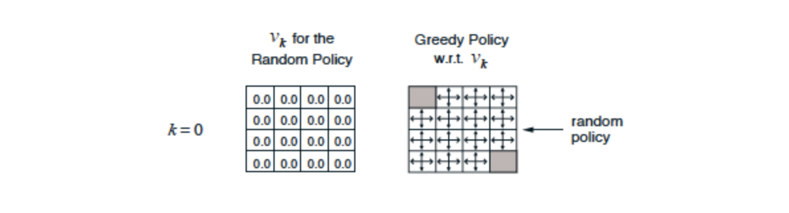

------

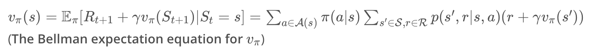

- In order to obtain the state-value function vπ corresponding to a policy π, we need only solve the system of equations corresponding to the Bellman expectation equation for v.
- While it is possible to analytically solve the system, doing so for large state and action space is not feasible thus; the **iterative solution approach**.
- The iterative method begins with an initial guess for the value of each state. In particular, we began by assuming that the value of each state was zero.
- Then, we looped over the state space and amended the estimate for the state-value function through applying successive update equations.

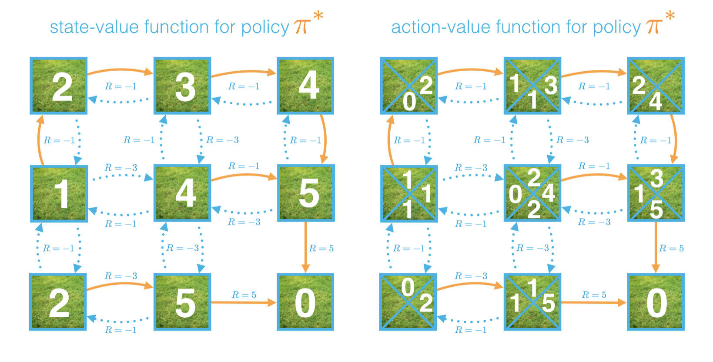

### General Function Defination

--------

- `env`: This is an instance of an OpenAI Gym environment, where `env.P` returns the one-step dynamics, (`env.nS`) returns number of states and (`env.nA`) returns number of actions.
- `gamma`: This is the discount rate.  It must be a value between 0 and 1, inclusive (default value: `1`).
- `theta`: This is a very small positive number that is used to decide if the estimate has sufficiently converged to the true value function (default value: `1e-8`).
- `max_it`: This is a positive integer that corresponds to the number of sweeps through the state space (default value: `1`).
- `V`: This is a 1D numpy array with `V.shape[0]` equal to the number of states (`env.nS`).  `V[s]` contains the estimated value of state `s` under the policy.
- `q`: This is a 1D numpy array with `q.shape[0]` equal to the number of actions (`env.nA`).  `q[a]` contains the (estimated) value of state `s` and action `a`.
- `policy`: This is a 2D numpy array where `policy[s][a]` returns the probability that the agent takes action `a` while in state `s` under the policy.

------
Example of equiprobable random policy 𝜋 in which each action has equal probability of getting selected, where 𝜋(𝑎|𝑠)=1/A(s)| for all s∈S and a∈A(s).

```python
policy = np.ones([env.nS, env.nA]) / env.nA
```

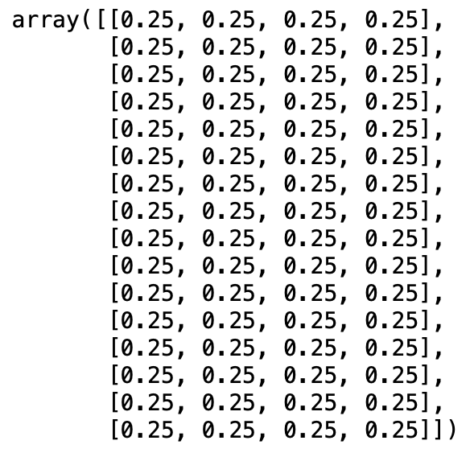


### Iterative Policy Evaluation

------
**Iterative policy evaluation** is an algorithm used in the dynamic programming setting to estimate the state-value function corresponding to a policy. In this approach, a Bellman update is applied to the value function estimate until the changes to the estimate are nearly imperceptible.

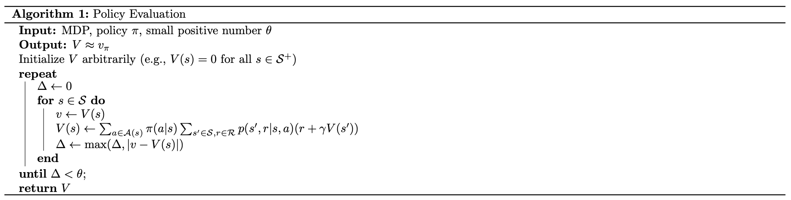

```python
def policy_evaluation(env, policy, gamma=1, theta=1e-8):
    V = np.zeros(env.nS)
    while True:
        delta = 0
        for s in range(env.nS):
            Vs = 0
            for a, action_prob in enumerate(policy[s]):
                for prob, next_state, reward, done in env.P[s][a]:
                    Vs += action_prob * prob * (reward + gamma * V[next_state])
            delta = max(delta, np.abs(V[s]-Vs))
            V[s] = Vs
        if delta < theta:
            break
    return V
```

### Estimation of Action Values
------
In the dynamic programming setting, it is possible to quickly obtain the action-value function Q(s,a) from the state-value function with the equation.

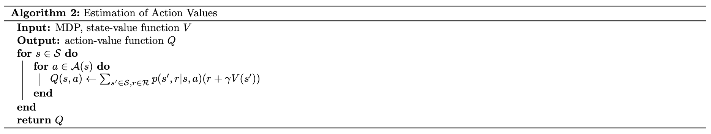

```python
def estimation_of_action_value(env, V, s, gamma=1):
    q = np.zeros(env.nA)
    for a in range(env.nA):
        for prob, next_state, reward, done in env.P[s][a]:
            q[a] += prob * (reward + gamma * V[next_state])
    return q
```

### Policy Improvement
------
**Policy improvement** takes an estimate V of the action-value function corresponding to a policy π, and returns an improved (or equivalent) policy prime π′, where π′≥π. The algorithm first constructs the action-value function estimate Q. Then, for each state, you need only select the action a that maximizes Q(s,a).

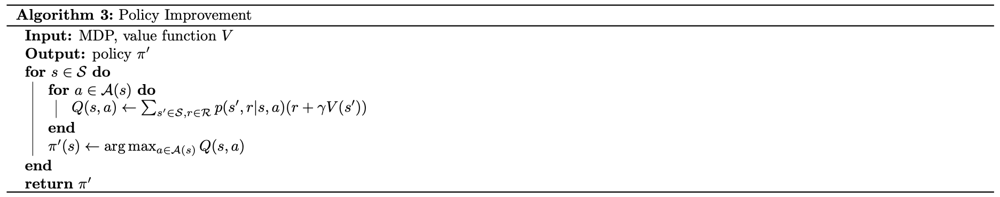

```python
def policy_improvement(env, V, gamma=1):
    policy = np.zeros([env.nS, env.nA]) / env.nA
    for s in range(env.nS):
      q = np.zeros(env.nA)
      for a in range(env.nA):
          for prob, next_state, reward, done in env.P[s][a]:
              q[a] += prob * (reward + gamma * V[next_state])
      policy[s][np.argmax(q)] = 1
    return policy
```

### Policy Iteration
------
**Policy iteration** is an algorithm that can solve an MDP in the dynamic programming setting. It proceeds as a sequence of policy evaluation and improvement steps, and is guaranteed to converge to the optimal policy (for an arbitrary *finite* MDP).

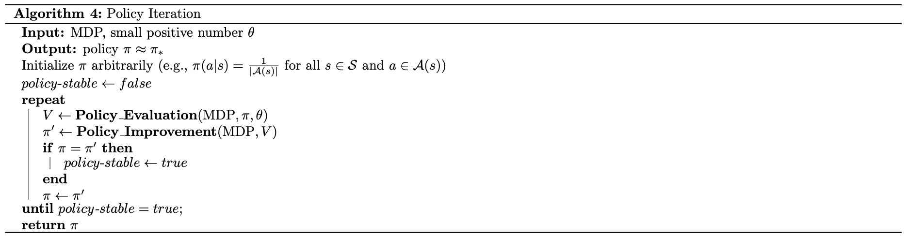

```python
def policy_iteration(env, gamma=1, theta=1e-8):
    policy = np.ones([env.nS, env.nA]) / env.nA
    while True:
        V = policy_evaluation(env, policy, gamma, theta)
        policy_prime = policy_improvement(env, V, gamma)
        if (policy == policy_prime).all():
            break
        policy = copy.copy(policy_prime)
    return policy, V
```

### Truncated Policy Iteration
------
**Truncated policy iteration** is an algorithm used in the dynamic programming setting to estimate the state-value function corresponding to a policy. In this approach, the evaluation step is stopped after a fixed number of sweeps through the state space. We refer to the algorithm in the evaluation step as **truncated policy evaluation**.

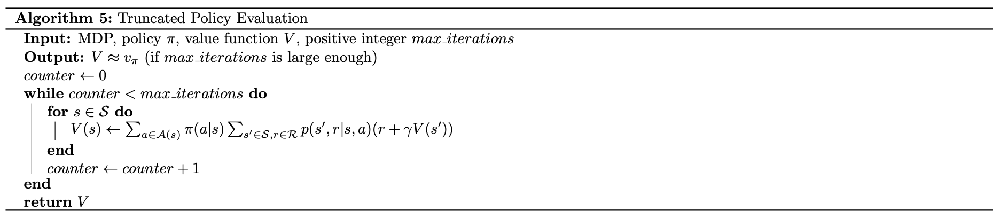

```python
def truncated_policy_evaluation(env, policy, V, max_it=1, gamma=1):
    counter = 0
    while counter <= max_it:
        for s in range(env.nS):
            v = 0
            for a, action_prob in enumerate(policy[s]):
                for prob, next_state, reward, done in env.P[s][a]:
                    v += action_prob * prob * (reward + gamma * V[next_state])
            V[s] = v
        counter += 1 
    return V
```

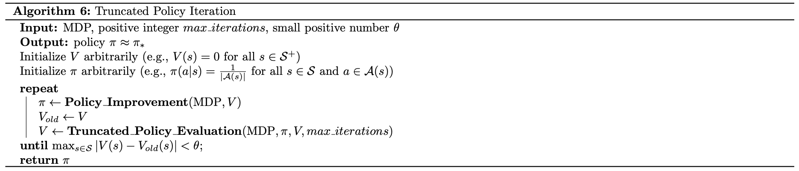

```python
def truncated_policy_iteration(env, max_it=1, gamma=1, theta=1e-8):
    V = np.zeros(env.nS)
    policy = np.zeros([env.nS, env.nA]) / env.nA
    while True:
        policy = policy_improvement(env, V)
        V_old = copy.copy(V)
        V = truncated_policy_evaluation(env, policy, V, max_it, gamma)
        if max(np.abs(V - V_old)) < theta:
            break
    return policy, V
```

### Value Iteration
------
**Value iteration** is an algorithm used in the dynamic programming setting to estimate the state-value function corresponding to a policy. In this approach, each sweep over the state space simultaneously performs policy evaluation and policy improvement.

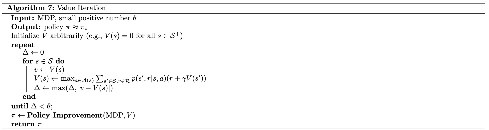

```python
def value_iteration(env, gamma=1, theta=1e-8):
    V = np.zeros(env.nS)
    while True:
        delta = 0
        for s in range(env.nS):
            v = V[s]
            V[s] = np.max(estimation_of_action_value(env, V, s, gamma))
            delta = max(delta,abs(V[s]-v))
        if delta < theta:
            break
    policy = policy_improvement(env, V, gamma)
    return policy, V
```

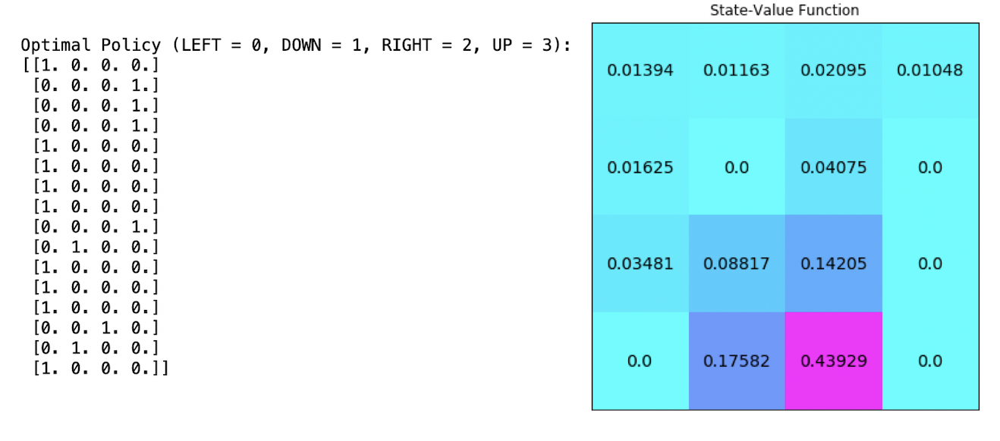

------
This project is a part of [Udacity Deep Reinforcement Learning Nanodegree](). Follow the instructions in `Dynamic_Programming.ipynb` to write your own implementations of many dynamic programming algorithms!